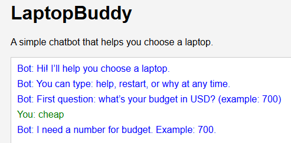
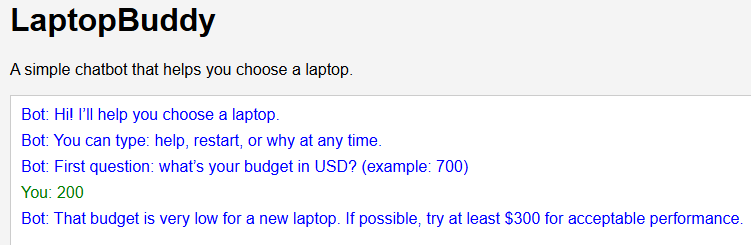
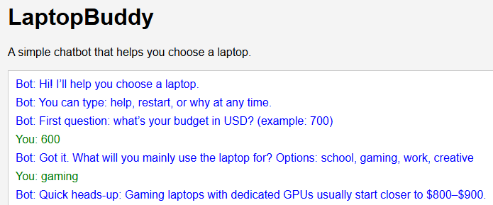
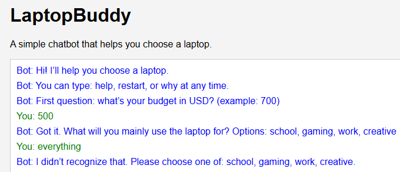

# LaptopBuddy Chatbot

LaptopBuddy is a simple, browser-based chatbot that helps users choose a laptop based on their budget and needs.

The goal of this project is not to build a complex AI system, but to demonstrate thoughtful conversation design, realistic decision-making, and good user experience.

---

## Scenario Chosen

**Assisting a customer with choosing the right product (laptop).**

Users are guided through a short conversation where the chatbot:
- Collects key requirements
- Handles unclear or unrealistic inputs
- Explains tradeoffs
- Produces a realistic recommendation

---

## How to Run the Project

### Option 1: Live Server (recommended)

1. Open the project folder in VS Code
2. Open `web/index.html`
3. Click **Go Live** (Live Server extension)
4. The chatbot opens in your browser

### Option 2: Open directly

1. Navigate to the `web` folder
2. Double-click `index.html`

---

## Conversation Flow

The chatbot follows a structured, step-by-step flow:

1. Ask for the user’s **budget**
2. Ask for the **primary use case**
3. Ask about **portability**
4. Ask for **OS preference**
5. Generate a recommendation based on realistic constraints

A visual decision tree is provided in `docs/flowchart.mmd`.

---

## Error Handling Examples

The chatbot is designed to handle common edge cases gracefully.

### Example 1: Non-numeric budget
**User:** `cheap`  
**Bot:** Explains that a number is required and asks again.



--- 

### Example 2: Unrealistic budget
**User:** `$200`  
**Bot:** Warns that this budget is too low for a new laptop and suggests a realistic minimum.



---

### Example 3: Gaming with low budget
**User:** Budget `$600`, Use case `gaming`  
**Bot:** Warns that gaming laptops with dedicated GPUs usually cost more and adjusts expectations.



---

### Example 4: Unknown option
**User:** `everything`  
**Bot:** Explains valid options and asks the user to choose again.



---

## Recommendation Logic

Laptop recommendations are based on **realistic market pricing**:

- Under $600: integrated graphics, lower storage
- $600–$900: better multitasking, still mostly integrated graphics
- $900+: higher RAM, larger SSDs, dedicated GPUs when appropriate

The chatbot intentionally avoids recommending unrealistic hardware combinations (for example, dedicated GPUs at very low budgets).

---

## Design Choices

- Short, conversational responses instead of long paragraphs
- One bot message per turn, formatted with line breaks for clarity
- Global commands (`help`, `restart`, `why`) available at any time
- Transparent reasoning to build user trust

---

## Possible Improvements

If more time were available, the chatbot could be improved by:

- Using a real product catalog instead of generalized specs
- Adding quick-reply buttons for common answers
- Supporting comparisons between two recommendations
- Persisting user state across sessions

---

## Files Overview

```
laptop-buddy-chatbot/
│
├── web/
│   ├── index.html
│   │   Entry point for the chatbot UI. Defines the chat layout and connects
│   │   styling and behavior.
│   │
│   ├── styles.css
│   │   Handles all visual styling for the chatbot interface, including layout,
│   │   spacing, and message formatting.
│   │
│   └── app.js
│       Core chatbot logic. Implements the conversation flow, state management,
│       error handling, and recommendation rules.
│
├── docs/
│   └── flowchart.mmd
│       Mermaid flowchart representing the chatbot’s conversation paths,
│       decision points, and error recovery.
│
├── slides/
│   └── Presentation PDF
|
|
├── screenshots/
|    └── Example screenshots
│
└── README.md
    Project overview, setup instructions, design rationale, and examples.
